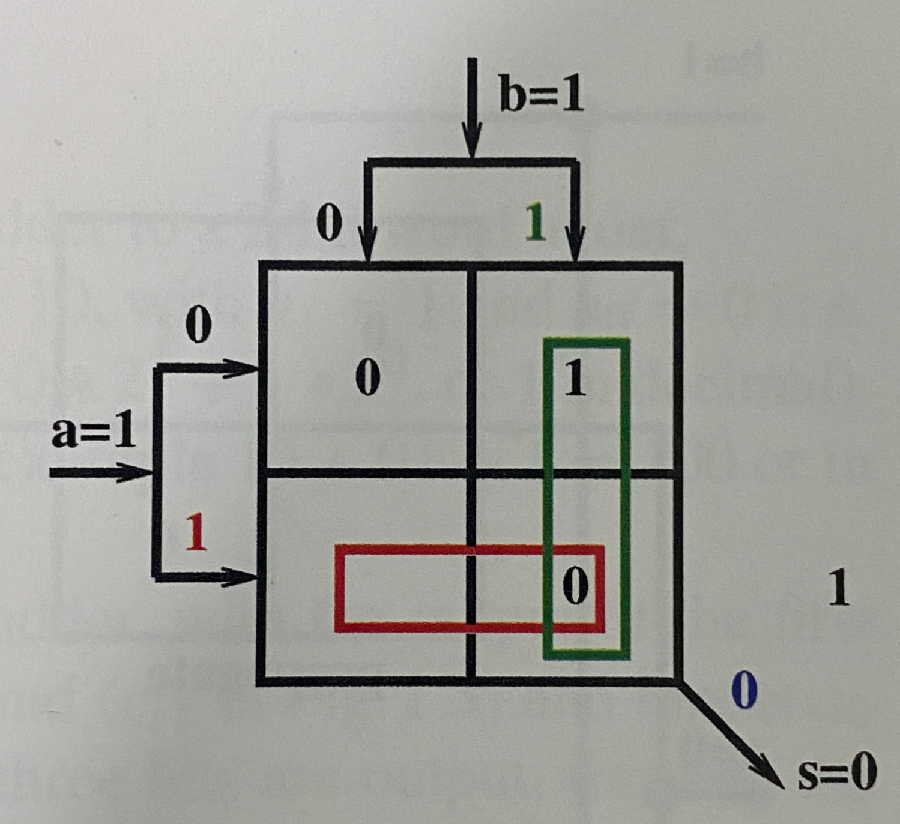

## 1.1 What Hardware to Put in an FPGA?

**The modulo 2 sum**

a xor b = c

|a|b|c|
|---|---|---|
|0|0|0|
|0|1|1|
|1|0|1|
|1|1|0|

**CARRY**:

a ^ b = c

|a|b|c|
|---|---|---|
|0|0|0|
|0|1|0|
|1|0|0|
|1|1|1|

```hdl
s <= a xor b;
c <= a and b;
```

## 1.2 LUT:A Piece of Hardware to Store a Truth Table

LUT is a hardware device which is similar to a memory.

$2^{n}$-bit LUT (or a LUT-n) can contain the truth table of a Boolean function of n variables.

For example, 

NOT:
|a|NOT(a)|
|---|---|---|
|0|1|
|1|0|

Stores $2^{1}$ truth values.

AND:
|a|b|s|
|---|---|---|
|0|0|0|
|0|1|0|
|1|0|0|
|1|1|1|

Stores $2^{2}$ truth values.


In an FPGA, a LUT is represented by a memory, i.e. an addressable hardware device.



## 1.3 Combining LUTs


